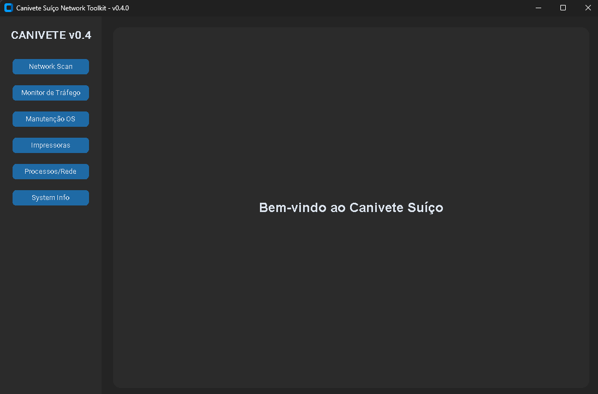
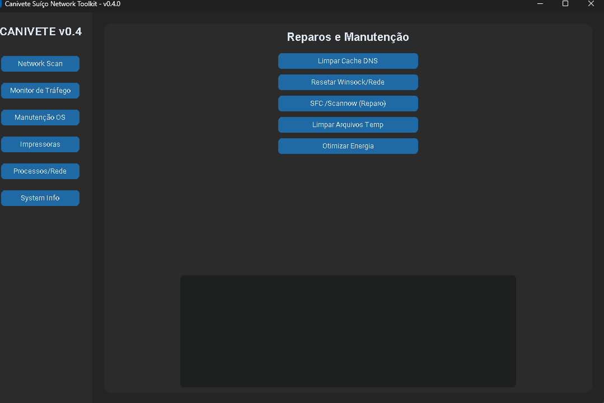
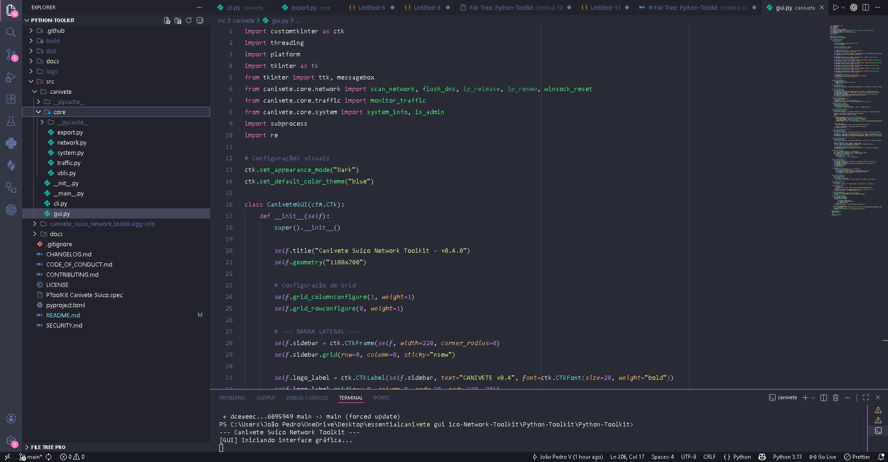

# 🔪 Canivete Suíço - Network Toolkit (v0.4.0)

<p align="center"> 
   
   
   
   
   
</p>

O **Canivete Suíço** é uma solução modular de alto desempenho projetada para engenheiros de sistemas e administradores de rede. Esta suíte centraliza utilitários críticos de diagnóstico, manutenção de infraestrutura e automação de rotinas operacionais em uma interface unificada de última geração.

---

## 📸 Enterprise Dashboard Preview

<p align="center">
  <a href="https://github.com/joaopedrosvr97-hub/Canivete-Sui-o-Python-Toolkit">
    
  </a>
  <br>
  <i><b>System Core:</b> Interface moderna baseada em CustomTkinter com suporte a temas dinâmicos.</i>
</p>

<table align="center" style="border: none;">
  <tr>
    <td align="center" style="border: none;">
      <a href="src/docs/config.png">
        
      </a>
      <br><sub><b>OS Management & Maintenance</b></sub>
    </td>
    <td align="center" style="border: none;">
      <a href="src/docs/main_gui.png">
        
      </a>
      <br><sub><b>Enterprise Project Architecture (src-layout)</b></sub>
    </td>
  </tr>
</table>

---

## 🛠️ Stack Técnica e Capacidades

* **Core Engine:** Python 3.9+ com arquitetura modular.
* **GUI Framework:** `CustomTkinter` para UI/UX acelerada por hardware.
* **System Integration:** Hooks nativos para Win32 API e subprocessos Unix.
* **Network Intelligence:** Monitoramento de I/O em tempo real e scan de sub-redes.

---

## 🆕 Release Notes - v0.4.0 (GUI Milestone)

* **Modularization:** Transição completa para o padrão `src-layout` (PEP 517/518).
* **Maintenance Suite:** Implementação de triggers para integridade de sistema (SFC, DISM).
* **Print Services:** Módulo especializado para gestão de Spooler e patches de registro.
* **CI/CD Ready:** Integração com GitHub Actions para validação automatizada de pacotes.

---

## 🚀 Deployment & Quick Start

### Requisitos de Ambiente
* Terminal com **Privilégios Elevados** (Run as Administrator / Sudo).
* Interpretador Python 3.9 ou superior instalado.

### Procedimento de Instalação (Windows/Linux)

*1. git clone https://github.com/joaopedrosvr97-hub/Python-Toolkit.git
*2. Navegação para o Diretório de Build
*3. Nota: O caminho deve ser seguido rigorosamente para localizar o pyproject.toml
*4. cd Canivete-Suico-Network-Toolkit/Python-Toolkit/Python-Toolkit
*5. Instalação do Pacote em Modo Editável (Developer Mode)
pip install -e .

# 4. Inicialização do Binário
canivete-gui 

📂 Arquitetura do Sistema (Project Blueprint)

A estrutura segue o padrão 'src-layout', garantindo isolamento entre o core da aplicação e os scripts de distribuição.

```text
📦 Python-Toolkit
 ┣ 📂 .github/workflows      # Pipelines de CI/CD (Automation)
 ┣ 📂 docs/                  # Documentação técnica estendida
 ┣ 📂 src/
 ┃ ┗ 📂 canivete/            # Namespace principal do pacote
 ┃   ┃ ┣ 📂 core/            # Business Logic Layer
 ┃   ┃ ┃ ┣ 📜 network.py     # Diagnóstico de rede e Scans
 ┃   ┃ ┃ ┣ 📜 system.py      # Hooks de reparo OS (SFC/DISM)
 ┃   ┃ ┃ ┣ 📜 traffic.py     # Monitoramento I/O em tempo real
 ┃   ┃ ┃ ┗ 📜 export.py      # Módulo de exportação de logs
 ┃   ┃ ┣ 📂 docs/            # Assets estáticos (Images/PNG)
 ┃   ┃ ┣ 📜 gui.py           # Presentation Layer (CustomTkinter)
 ┃   ┃ ┣ 📜 cli.py           # Legacy Terminal Interface
 ┃   ┃ ┗ 📜 __main__.py      # App Entry Point
 ┣ 📜 pyproject.toml         # Packaging & Dependencies (PEP 517)
 ┣ 📜 CHANGELOG.md           # Histórico de versões
 ┗ 📜 LICENSE                # MIT Compliance
